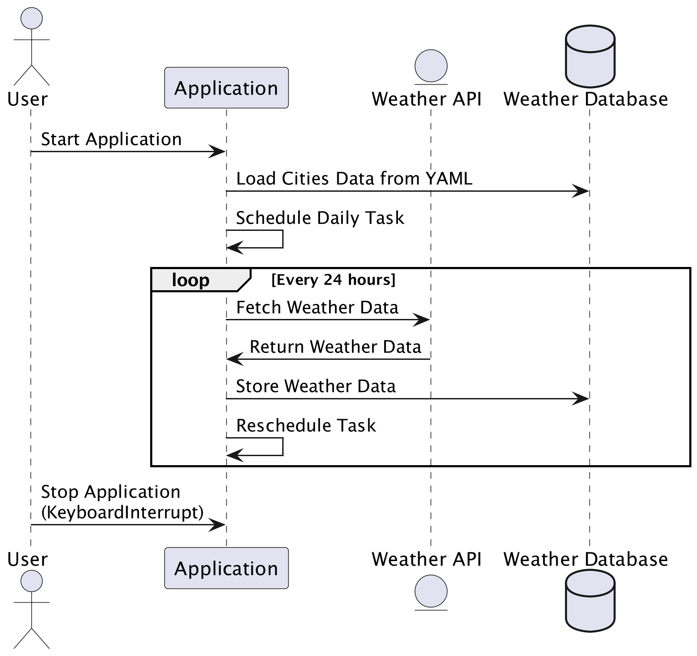

# Open Weather Data Collect

## Project Overview
This project is designed to collect weather data using the OpenWeatherMap API. It organizes the data for further analysis and can be deployed using Docker.

## App Diagram
<p align="center">
    
</p>

## Prerequisites
- Docker
- Docker Compose
- Python 3.10 or higher
- Make

## Configuration
Create a `.env` file in the root directory of the project with the necessary environment variables:

### `.env`
```env
POSTGRES_USER=<your_postgres_username>
POSTGRES_PASSWORD=<your_postgres_password>
API_KEY=<your_weather_api_key>
```

Replace `<your_postgres_username>`, `<your_postgres_password>`, and `<your_weather_api_key>` with your actual PostgreSQL credentials and the API key for the weather service.

### `cities.yaml`
The `cities.yaml` file contains a list of cities for which the application fetches weather data. Below is an explanation of its structure and how to modify it:

```yaml
Cities:
  Lisbon:
    Country: Portugal
    lat: 38.7166667
    long: -9.1333332
```

Each city is a key under the `Cities` section, and each has sub-keys for `Country`, `lat` (latitude), and `long` (longitude). These details are used to accurately locate the city for weather data queries. To add a new city, replicate the structure of the existing entries, filling in the respective country, latitude, and longitude. This customization allows you to gather weather data specifically tailored to your geographical preferences.

## Setup Instructions

### Environment Setup

To set up the project environment, follow these steps:

1. **Clone the repository.**
   Make sure you have access to the repository and clone it to your local machine using:
   ```bash
   git clone https://github.com/gabrielclimb/openweatherdatacolllect.git
   ```

2. **Ensure you have Python and Docker installed.**
   This project requires Python and Docker. Please install them from their official websites if they are not already installed on your machine.

3. **Install required Python packages.**
   Run the following command to set up the Python virtual environment and install all the required packages:
   ```bash
   make setup
   ```


## Running the Application

### Using Docker Compose
1. **Start the Application**
   ```bash
   make run-scheduler
   ```
   This builds the application image, starts the database, runs migrations, and launches the application.

2. **Stop the Application**
   ```bash
   make stop-scheduler
   ```

### Running the Application Locally (Without Docker)
If you prefer to run the application directly on your local machine:
1. **Set Environment Variables**
   Export the necessary environment variables from the `.env` file or set them manually in your terminal.

2. **Start the Application**

   - run ingestion

        ```bash
        make run-local-ingestion
        ```
        This command triggers the data ingestion process immediately, useful for manual updates or testing.

   - run ingestion
        ```bash
        make run-local-scheduler
        ```
        This command initiates the scheduler, which is configured to periodically trigger the data ingestion process.


## Running Tests
To run tests, you can use the included Makefile:
```bash
make test
```

## Additional Configuration
- **Environment Variables:** Configure necessary API keys and settings in the `.env` file.
